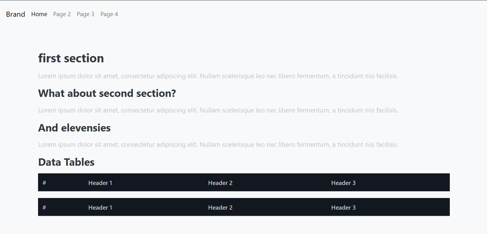

#   Flask Template

##  A consistient jumping off point for quick flask apps 

##  How to use this template:

### create a new virtual environment

    python -m venv venv

### inside of your new virtual environment ensure you have flask installed

    pip install flask

### Run the application to ensure it funcitons. 

    python app.py

You should see some form of

    * Serving Flask app 'app'
    * Debug mode: on
    WARNING: This is a development server. Do not use it in a production deployment. Use a production WSGI server instead.
    * Running on all addresses (0.0.0.0)
    * Running on http://127.0.0.1:5000
    * Running on http://[yourLocalIPAddress]:5000 #SEE NOTES
    Press CTRL+C to quit
    * Restarting with stat
    * Debugger is active!
    * Debugger PIN: [your debugger pin]

Navigate to http://127.0.0.1:5000 

if you see something like this:

Everything is working.

If you don't see something like that:
Something is broken. Good luck!

##  Building upon this app:

### Add New Routes:

You can define routes in app.py using the @app.route decorator.

    @app.route('/testing')
    def testing():
        return "tested"

### Create New Templates:
Add new HTML files to the `templates` diretory 

    <!-- templates/test.html -->
    <!DOCTYPE html>
    <html lang="en">
    <head>
        <meta charset="UTF-8">
        <meta name="viewport" content="width=device-width, initial-scale=1.0">
        <title>New Page</title>
        <link rel="stylesheet" href="{{ url_for('static', filename='css/styles.css') }}">
    </head>
    <body>
        <h1>Test</h1>
        
This is a new test page in the Flask app.

    </body>
    </html>

Make sure to add a route for this (this is different than my /testing route example)

### Static Files:

static files go in the `static` directory. you can reference them in your templates like this:

    <link rel="stylesheet" href="{{ url_for('static', filename='css/new_styles.css') }}">

### Notes:

This is the IP you will use to view this on another device on your network. If you want to navigate to it from outside of your home network I suggest an overlay network such as wireguard, tailscale is a popular user friendly implementation. Port forwarding to this is always a bad idea. Even if you think you know better, it's a bad idea.